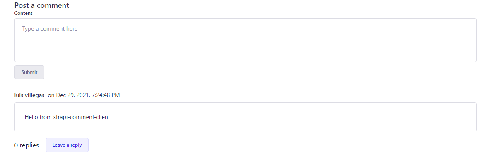
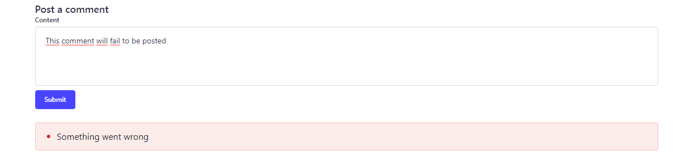

# Strapi Comment Client

Display comments from the [Strapi Comment Manager plugin](https://npmjs.com/package/strapi-plugin-comment-manager) easily, with components from the [Strapi Design System](https://design-system-alpha.vercel.app), which was introduced in [Strapi V4](strapi.io/blog/announcing-strapi-v4).

This component library fully supports Typescript.

## Installation

You will need to have installed **react ^17.0.2**, **react-dom ^17.0.2** and **react-router-dom ^5.2.0**.

    npm install strapi-comments-client --save

## Usage

Using this library is very easy!

This library exports three main components:
`CommentsProvider`, `Comments` and `CommentForm`

    import {
      CommentsProvider,
      Comments,
      CommentForm
    } from "strapi-comments-client"

All you have to do is to wrap your App component into the `CommentsProvider` component and then you will be able to place the `Comments` component to render a list of comments for a given content ID and the `CommentForm` component to render a form to post comments anywhere in your app!

This could be your index.js or main.js file:

    import React from 'react'
    import ReactDOM from 'react-dom'

    const STRAPI = "http://localhost:1337" // The address of your strapi backend instance

    ReactDOM.render(
      <React.StrictMode>
        <CommentsProvider apiURL={STRAPI}>
          <App />
        </CommentsProvider>
      </React.StrictMode>,
      document.getElementById('root')
    )

Where `apiURL` is the URL of your running Strapi application, and this property is *required*.

This way, the comments provider will do all the magic of fetching and posting comments for you!

This library also exports an utility `React.Context` to update some of the parameters for fetching and posting comments:

    import { CommentsConfigContext } from "strapi-comments-client"

This `CommentsConfigContext` exposes two setter functions: `setUser` and `setContentID`

With `setContentID` you can load the comments for a given content and post comments to it. It receives a single parameter of type `string` and must be something that can be URLized i.e. no spaces.

With `setUser` you can set the credentials of a given user to authorize the posting of comments. It receives a single parameter of type `IUser`, which is a *Typescript interface*:

    interface IUser {
      username: string,
      email: string,
      id: string,
      token: string
    }

It's a little confusing but we'll see how to use it in a component:

    const App = () => {
      const { setUser, setContentID } = useContext(CommentsConfigContext)
      // The following data should come from Strapi Users and Permissions Plugin for authenticated requests
      const user = {
        username: "John Doe",
        email: "jhohndoe@gmail.com",
        id: 5,
        token: "this_should_be_a_JWT"
      }
      if (user) {
        setUser(user)
      }
      setContentID("sample-content-1") // Load comments for this content
      return (
        <>
          {
            !user && <Login />
          }
          <CommentForm />
          <Comments />
        </>
      )
    }

And that's it!

After setting the content ID through `setContentID`, `CommentsProvider` will start loading the comments for the given content ID and the `CommentForm` will render a few inputs to post comments related to the given content ID **IF** there is a user. Otherwise, it will display the message `Login to post a comment`.

Here's how the interface looks like so far:

Notice that there's also a button to Leave a reply, which posts subcomments associated with the parent comment.

There's one more component that this library exports: `ErrorBox`

    import { ErrorBox } from "strapi-comments-client"

It's useful if you'd like to display error messages when things go wrong fetching or posting comments.

You can place this component wherever you want, for example in between the `CommentForm` and the `Comments` components.

If you're wondering how the error box looks like, here you have a sample:

## Full example

If you'd like to check a full implementation of this library in a `React` project, you can check [this repo](https://github.com/luisguve/strapi-comments-client-example)
